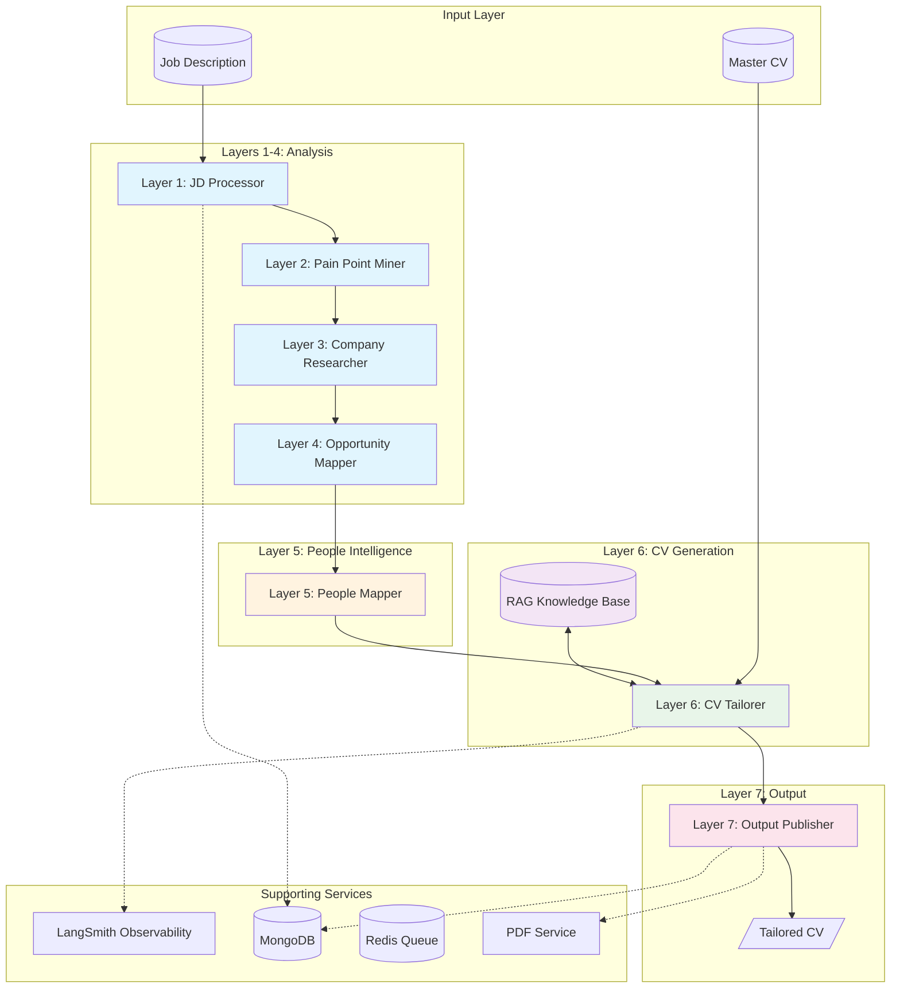

# Job Intelligence Pipeline

> A 7-layer agentic AI system for intelligent job search automation

[](https://github.com/taimooralam/job-search/actions/workflows/e2e-tests.yml)
[](https://github.com/taimooralam/job-search/actions/workflows/frontend-ci.yml)
[](https://github.com/taimooralam/job-search/actions/workflows/runner-ci.yml)
[](https://www.python.org/downloads/release/python-3110/)
[](https://langchain-ai.github.io/langgraph/)
[](https://www.mongodb.com/)
[](https://fastapi.tiangolo.com/)

## Overview

Production-grade agentic AI pipeline processing job descriptions through specialized layers—from JD analysis to personalized CV generation. Built with LangGraph for multi-agent orchestration, RAG for knowledge retrieval, and full observability via LangSmith.

**Key Capabilities:**
- Process job descriptions through 7 specialized AI agents with full traceability
- Automated CV tailoring with ATS optimization and role-specific achievement selection
- Production-grade observability via LangSmith tracing across all pipeline layers

## Architecture



### Layer Descriptions

| Layer | Name | Purpose |
|-------|------|---------|
| **1** | JD Processor | Parse and structure job descriptions, extract requirements |
| **2** | Pain Point Miner | Identify challenges and pain points from JD signals |
| **3** | Company Researcher | Gather company intelligence via web scraping |
| **4** | Opportunity Mapper | Map opportunities to candidate strengths |
| **5** | People Mapper | Research key stakeholders and decision makers |
| **6** | CV Tailorer | Generate ATS-optimized CV using RAG retrieval |
| **7** | Output Publisher | Format and publish final deliverables |

## Features

- **Multi-Agent Orchestration**: 7-layer LangGraph pipeline with tool use, planning, and structured outputs
- **RAG Knowledge System**: MongoDB vector search with evaluation frameworks and retrieval quality metrics
- **Production Patterns**: Circuit breaker, rate limiter, structured logging, graceful degradation
- **Full Observability**: LangSmith tracing across all pipeline layers
- **CV Generation**: ATS-optimized, role-tailored output with hallucination guards
- **Web UI**: Flask-based frontend with TipTap rich-text CV editor

## Tech Stack

| Component | Technology |
|-----------|------------|
| **Orchestration** | LangGraph |
| **LLM** | Claude API (Anthropic) |
| **Database** | MongoDB (with vector search) |
| **Backend** | FastAPI, Flask |
| **Queue** | Redis |
| **Observability** | LangSmith, OpenSearch |
| **PDF Generation** | WeasyPrint |
| **Infrastructure** | Docker, Docker Compose |
| **Testing** | pytest, pytest-asyncio |

## Project Structure

```
job-search/
├── src/                    # Core pipeline implementation
│   ├── layer1_4/          # Analysis layers (JD, Pain Points, Company, Opportunity)
│   ├── layer5/            # People intelligence layer
│   ├── layer6_v2/         # CV generation with RAG
│   ├── layer7/            # Output publishing
│   ├── common/            # Shared utilities and repositories
│   ├── api/               # FastAPI endpoints
│   ├── services/          # Business logic services
│   └── analytics/         # Pipeline analytics
├── frontend/              # Flask web application
│   ├── templates/         # Jinja2 templates
│   ├── static/            # CSS, JS, assets
│   └── cv_editor/         # TipTap-based CV editor
├── runner_service/        # Background job runner
├── pdf_service/           # PDF generation service
├── tests/                 # Test suites
│   ├── unit/             # Unit tests
│   ├── integration/      # Integration tests
│   └── e2e/              # End-to-end tests
├── docker/               # Docker configurations
├── docs/                 # Documentation
└── example/              # Example data and configs
```

## Getting Started

### Prerequisites

- Python 3.11+
- MongoDB 6.0+ (with Atlas Search for vector search)
- Redis
- Docker & Docker Compose (optional)

### Installation

1. **Clone the repository**
   ```bash
   git clone https://github.com/yourusername/job-intelligence-pipeline.git
   cd job-intelligence-pipeline
   ```

2. **Create virtual environment**
   ```bash
   python -m venv .venv
   source .venv/bin/activate  # On Windows: .venv\Scripts\activate
   ```

3. **Install dependencies**
   ```bash
   pip install -e .
   ```

4. **Configure environment**
   ```bash
   cp example/example_config.env .env
   # Edit .env with your API keys and configuration
   ```

5. **Start services**
   ```bash
   docker-compose up -d  # Starts MongoDB and Redis
   ```

### Configuration

Key environment variables:

| Variable | Description |
|----------|-------------|
| `ANTHROPIC_API_KEY` | Claude API key |
| `MONGODB_URI` | MongoDB connection string |
| `REDIS_URL` | Redis connection URL |
| `LANGCHAIN_API_KEY` | LangSmith API key (optional) |
| `FIRECRAWL_API_KEY` | FireCrawl API key for web scraping |

See `example/example_config.env` for full configuration options.

### Running the Pipeline

```bash
# Start the API server
uvicorn src.api.main:app --reload

# Or run a single job through the pipeline
python -m src.layer1_4.run --job-id <mongodb_job_id>
```

### Running Tests

```bash
# Run all unit tests
pytest -n auto tests/unit/

# Run with coverage
pytest --cov=src tests/unit/
```

## API Endpoints

| Endpoint | Method | Description |
|----------|--------|-------------|
| `/jobs` | GET | List all jobs |
| `/jobs/{id}` | GET | Get job details |
| `/jobs/{id}/process` | POST | Process job through pipeline |
| `/cv/{id}` | GET | Get generated CV |
| `/health` | GET | Health check |

## Production Patterns

### Circuit Breaker
Protects against cascading failures when external services (LLM, web scraping) are unavailable.

### Rate Limiter
Respects API rate limits for Claude and FireCrawl APIs.

### Structured Logging
JSON-formatted logs with correlation IDs for distributed tracing.

### Graceful Degradation
Falls back to cached data or partial results when services are unavailable.

## Contributing

1. Fork the repository
2. Create a feature branch (`git checkout -b feature/amazing-feature`)
3. Commit your changes (`git commit -m 'Add amazing feature'`)
4. Push to the branch (`git push origin feature/amazing-feature`)
5. Open a Pull Request

## License

MIT License - see [LICENSE](LICENSE) for details.

---

*Built with LangGraph and Claude API*
